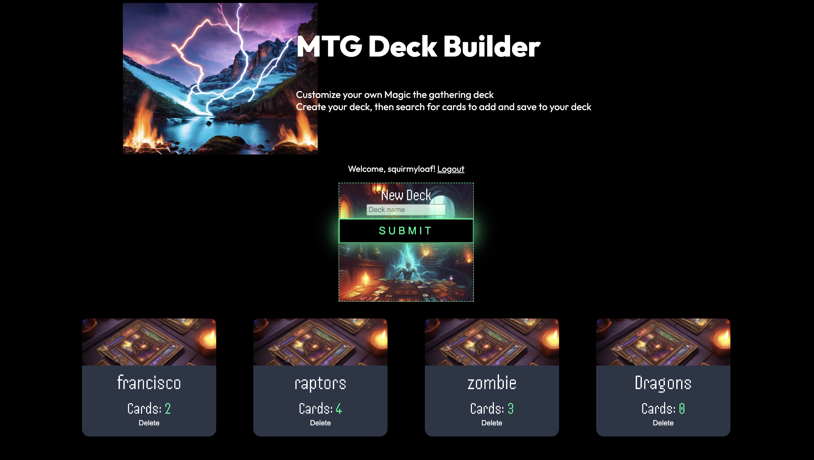

# MTG - Deckbuilder

This is MTG - Deckbuilder! A full-stack web app that allows you to look up cards so you can create and save your own custom deck. 

## Table of contents

- [MTG - Deckbuilder](#mtg---deckbuilder)
  - [Table of contents](#table-of-contents)
    - [Why?](#why)
    - [Screenshot](#screenshot)
    - [Built with](#built-with)
    - [What I learned](#what-i-learned)
    - [Continued development](#continued-development)
  - [Author](#author)

### Why?
My wife and her siblings and I all play Magic the gathering at home. I create all the decks for everyone to use and update the decks too. It didn't take long for me to start forgetting which cards ended up in which deck. Rather than look through 6 100 cards deck, I decided to create MTG - Deckbuilder! MTG - Deckbuilder allows me to create a deck by looking up and add cards to my deck with the Magic the gathering API. I then can come back and look at my deck or decks anytime I want since all this info is stored in a database. 

### Screenshot

### Built with

- Semantic HTML5 markup
- CSS custom properties
- Flexbox
- Javascript

### What I learned

One thing I learned doing this project was how to change the order of the elements being displayed with flexbox. I was a little stumped once I started working on the mobile layout. My basic layout for this app involved one parent container with 2 children that hold the text container and the image container for the left and right sides. 
I used flexbox with a flex-direction of flex to align the children. When styling for mobile, I changed the flex direction of the container to row. My problem was that I needed the img to be on top of the text but it was at the bottom because it's the second child. 
After googling a bit, I stumbled upon the reverse property for flex-direction, this allowed me to move the img child to be on top. 
It was really cool to learn a little trick like that from this project. 

### Continued development

Something I want to continue looking into is the img position/scaling in the mobile layout. I had a bit of trouble matching the sample img, my img was focused on a slightly different section of the picture.

## Author

- Website - https://asacripanti.github.io/portfolio/
- Frontend Mentor - https://www.frontendmentor.io/profile/asacripanti
- Github: https://github.com/asacripanti/
- Linkedin: https://www.linkedin.com/in/alejandro-sacripanti-7abaa823a/

